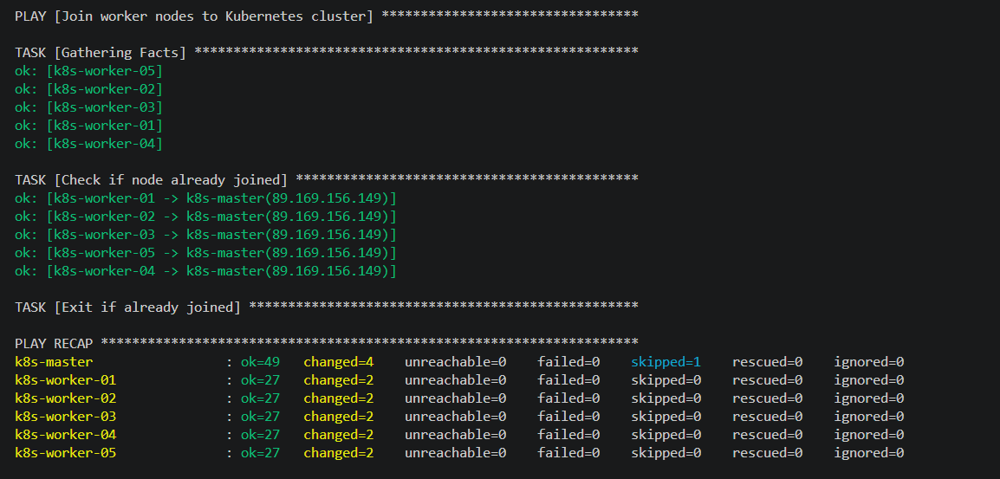
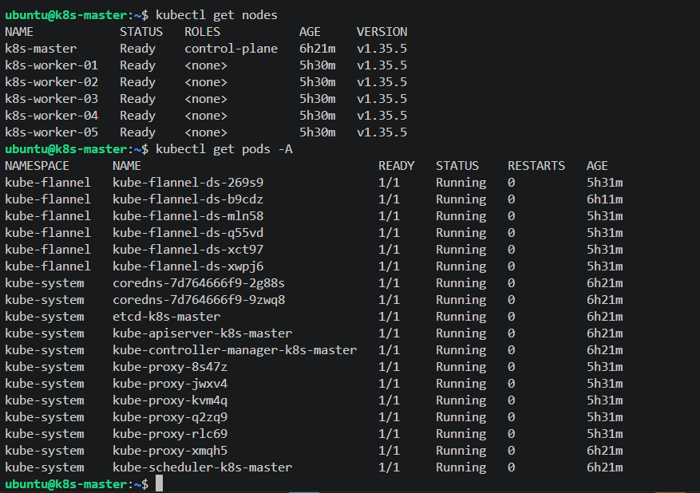

# Домашнее задание к занятию «Установка Kubernetes»

## Цель задания

Установить кластер K8s.

### Чеклист готовности к домашнему заданию

1. Развёрнутые ВМ с ОС Ubuntu 20.04-lts.


### Инструменты и дополнительные материалы, которые пригодятся для выполнения задания

1. [Инструкция по установке kubeadm](https://kubernetes.io/docs/setup/production-environment/tools/kubeadm/create-cluster-kubeadm/).
2. [Документация kubespray](https://kubespray.io/).
3. [Документация Terraform Yandex Provider](https://terraform-provider.yandexcloud.net/).
4. [Документация Ansible](https://docs.ansible.com/).

-----\n

### Задание 1. Установить кластер k8s с 1 master node

1. Подготовка работы кластера из 5 нод: 1 мастер и 4 рабочие ноды.
2. В качестве CRI — containerd.
3. Запуск etcd производить на мастере.
4. Способ установки выбрать самостоятельно.

------
### Задание 2*. Установить HA кластер

1. Установить кластер в режиме HA.
2. Использовать нечётное количество Master-node.
3. Для cluster ip использовать keepalived или другой способ.


## Решение

Установка кластера k8s
Установка cli от облачного провайдера:
```bash
curl -sSL https://storage.yandexcloud.net/yandexcloud-yc/install.sh | bash
```
Затем прикручиваем yc к нашему аккаунту провайдера, выбираем облако, рабочий каталог и зону по умолчанию:
```bash
yc init --username=<email_address>
# yc config set cloud-id <cloud-id>
# yc config set folder-id <folder-id>
# yc config set zone <zone>
```
Для проверки вызовем команду:
```bash
yc config get cloud-id
yc config get folder-id
yc config get zone
```
Далее нам нужен ключ для работы tf от УЗ sa.
[Здесь](https://yandex.cloud/ru/docs/cli/operations/authentication/service-account) описано как это сделать.

Последовательность такая:
Получим список sa из текущего каталога:
```bash
yc iam service-account list
# или указав нужный folder-id
yc iam service-account --folder-id $(yc config get folder-id)  list
```
Генерируем новый ключ для sa:
```bash
yc iam key create \
  --service-account-name <service-account-name> \
  --output <key-file> \
  --folder-id <folder-id>
```

Инициализируем проект:
```bash
terraform init
```
Проверяем синтаксис:
```bash
terraform validate
```
Ну и последний шаг - применяем конфигурацию:
```bash
terraform apply
```
Пересоздать отдельный ресурс terraform
```bash
terraform apply -replace='yandex_compute_instance.vms["k8s-master"]' --auto-approve
```

## Использование Ansible для установки Kubernetes

В качестве способа установки Kubernetes выбран Ansible. Это позволяет гибко управлять процессом установки, обеспечивает идемпотентность и упрощает отладку.


### Подготовка инфраструктуры

1. Установите Yandex Cloud CLI и настройте доступ:
```bash
curl -sSL https://storage.yandexcloud.net/yandexcloud-yc/install.sh | bash
yc init --username=<email_address>
yc config set cloud-id <cloud-id>
yc config set folder-id <folder-id>
yc config set zone <zone>
```

2. Создайте сервисный аккаунт и ключ:
```bash
yc iam service-account list
yc iam key create \
  --service-account-name <service-account-name> \
  --output ../vault/cloud-sa-key.json \
  --folder-id $(yc config get folder-id)
```

3. Сгенерируйте SSH-ключи:
```bash
ssh-keygen -t ed25519 -f ../vault/id_ed25519
```

4. Примените Terraform конфигурацию:
```bash
cd tf
terraform init
terraform apply -auto-approve
```

### Установка Kubernetes через Ansible

После создания VM запустите установку Kubernetes:

```bash
cd ansible
ansible-playbook install-k8s.yaml
```

Плейбук выполнит следующие этапы:

1. **01-bootstrap.yml** — установка необходимых пакетов для начальной работы
2. **10-master.yaml** — установка Kubernetes (containerd, kubelet, kubeadm, kubectl) на master:
   - Обновление пакетов
   - Отключение swap
   - Настройка ядра (modprobe overlay, br_netfilter)
   - Настройка sysctl параметров
   - Установка containerd с настройкой SystemdCgroup=true
   - Установка kubelet, kubeadm, kubectl
3. **11-worker.yaml** — установка Kubernetes на worker-ноды
4. **20-kubeadm-init.yaml** — инициализация кластера:
   - `kubeadm init` с параметрами:
     - Kubernetes 1.35.0
     - Pod CIDR: 10.244.0.0/16
     - Service CIDR: 10.96.0.0/12
   - Настройка kubeconfig для пользователя ubuntu
   - Установка Flannel CNI-плагина
   - Ожидание готовности master-ноды
5. **21-kubeadm-join.yaml** — присоединение worker-нод к кластеру





### Проверка и верификация
На master ноде:

После завершения установки проверьте статус кластера:

```bash
# Подключитесь к мастер-ноде
ssh ubuntu@<master-ip> -i ../vault/id_ed25519

# Проверьте узлы
kubectl get nodes

# Проверьте поды в системных неймспейсах
kubectl get pods -A
```




### Что не так

1. Большое количество констант в terraform
2. Большое количество констант в ansible
3. Отсутствие jumphost
4. Не вынесены константы в переменные, отсюда слабая структура и расширяемость